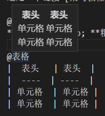
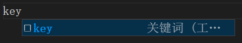
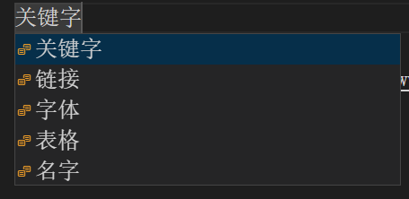
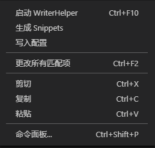

## 写作助手

### 介绍

鼠标指向在关键词后会弹出悬浮菜单，支持 MD ，可自定义关键词。

输入`key`后会自动补全，任你选择各种关键词。

悬浮菜单：



自动补全1：



自动补全2：



右键菜单：



### 开始

- `Ctrl+Shirft+P`或从右键菜单中打开**命令面板**。

- 选择**启动 WriterHelper** 启用插件。

- 或者按下`Ctrl+F10`热键。

- 或者在右键菜单中直接选择**启动 WriterHelper**。

- 新建文件，用`@`标记关键词，回车换行，写入需要在悬浮菜单显示的内容。

- 右键菜单中选择**写入配置**，则大功告成，以后启动插件时将自动读取该文件。

- 你同样可以在 vscode 设置中搜索 **Writer Helper: Path**,填入配置文件的路径。

- 当你需要自动补全关键词时，请建立工作区，并将右键菜单**生成 Snippets** 生成的 `writer-helper.code-snippets` 文件移至 `.vscode`下。


**参考配置文件如下**

data.txt

```
@关键字
## 二级标题
### 三级标题

@链接
这是一个链接 [WriterHelper](https://github.com/scueee/WriterHelper-vscode-plugin)

@字体
*斜体文本* &nbsp; **粗体文本**

@表格
|  表头   | 表头  |
|  ----  | ----  |
| 单元格  | 单元格 |
| 单元格  | 单元格 |

@名字
[玄派人名生成器](https://www.xuanpai.com/tool/names)
```

### 以下为一些可能会用到的 vscode 设置：

#### 打字机模式

`Editor: Cursor Surrounding Lines`
控制光标周围可见的前置行和尾随行的最小数目。在其他一些编辑器中称为“scrollOff”或“scrollOffset”。

#### 文本折叠

`Editor: Folding`
控制编辑器是否启用了代码折叠。

#### 自动换行

`Editor: Word Wrap`
控制折行的方式。

`Editor: Word Wrap Column`
在 Editor: Word Wrap 为 wordWrapColumn 或 bounded 时，控制编辑器的折行列。

#### 无干扰模式

`Ctrl + K Z` 进入禅模式
连按两次 ESC 退出

#### 折行缩进从第一列开始

`Editor: Wrapping Indent`
控制折行的缩进。

#### Tab 空两格

`Editor: Tab Size`
一个制表符等于的空格数。在 Editor: Detect Indentation 启用时，根据文件内容，该设置可能会被覆盖。

`Editor: Detect Indentation`
控制是否在打开文件时，基于文件内容自动检测 Editor: Tab Size 和 Editor: Insert Spaces。

#### 自动保存

`Files: Auto Save`
控制自动保存未保存的编辑器。有关自动保存的详细信息，请参阅此处。

`Files: Auto Save Delay`
控制自动保存未保存的编辑器之前经过的延迟(以毫秒为单位)。仅当 Files: Auto Save 设置为afterDelay时才适用。